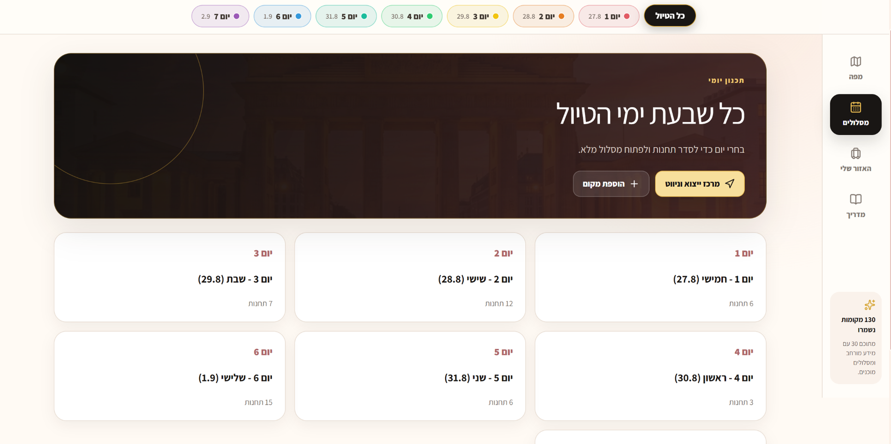
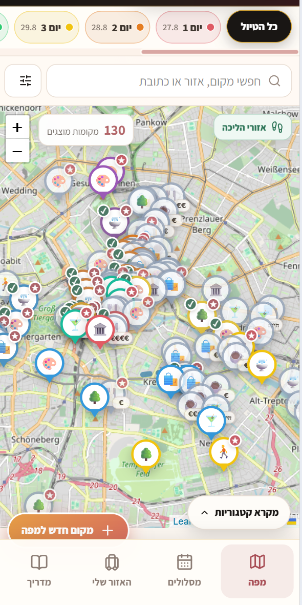
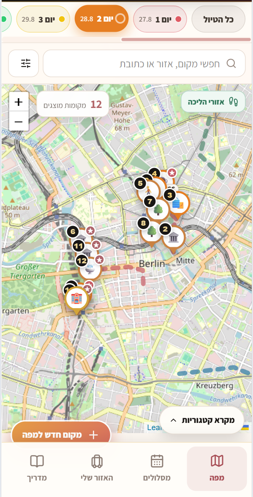
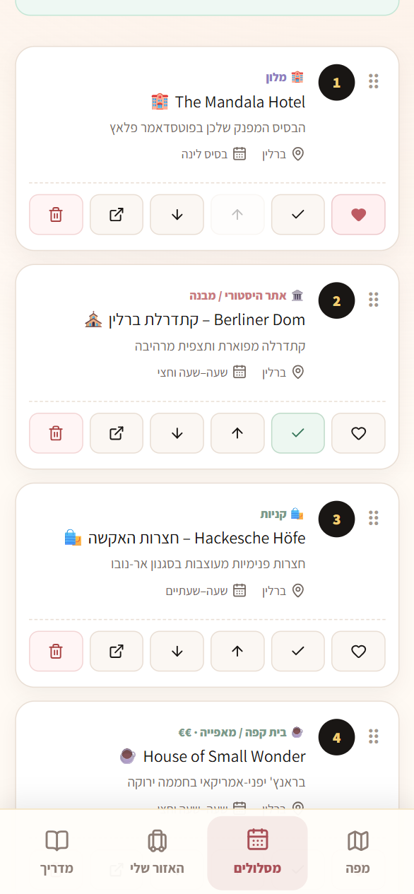
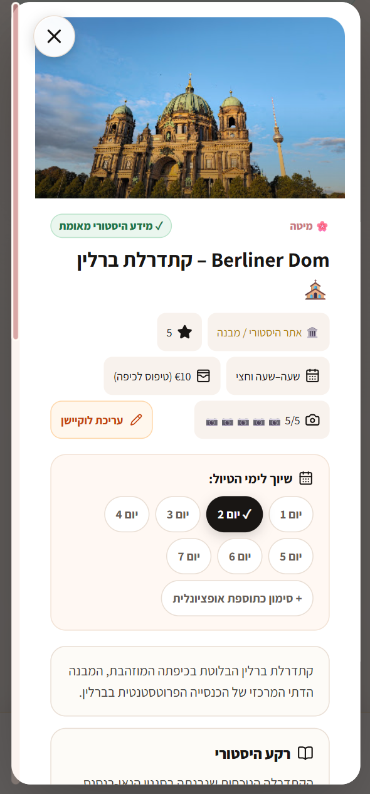
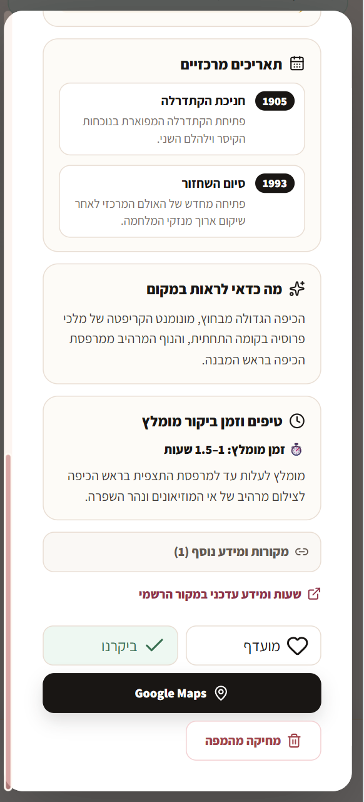
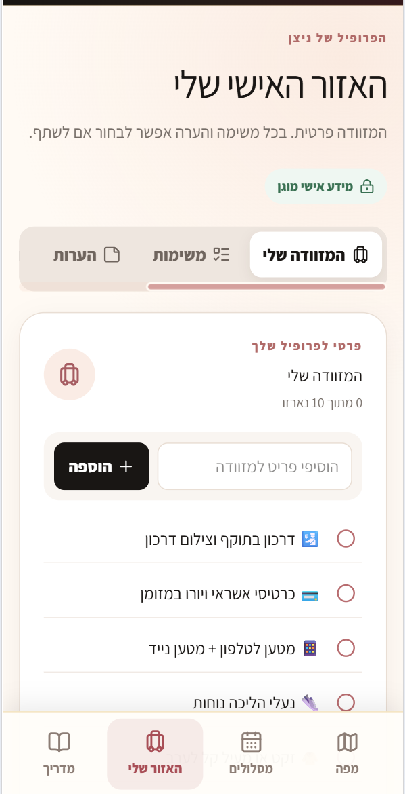
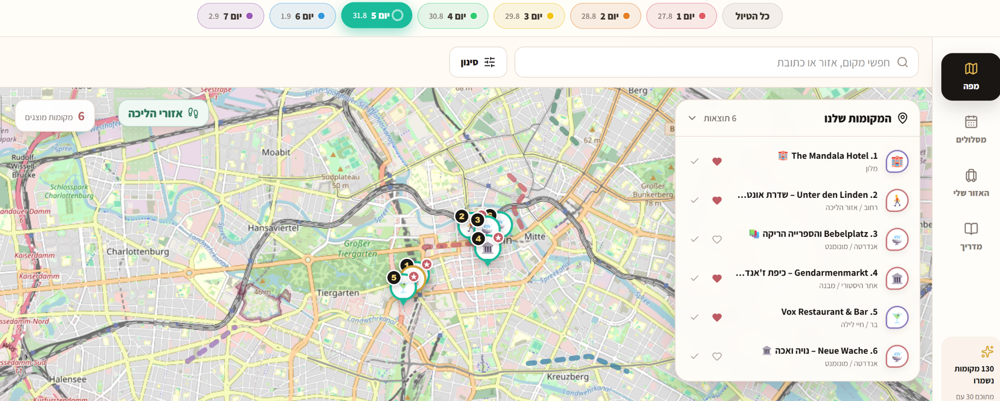

# Product Case Study

## Context

Berlin Trip Planner started as a practical problem: a multi-day trip had too many places, recommendations, links and notes spread across different sources.

The product was built for two real travelers and had to work in two very different contexts:

1. planning calmly before the trip
2. making fast decisions while already in Berlin

That dual context shaped the product more than the technology did.

The current product contains 130 curated places organized across 7 trip days.

## Product problem

The main pain points were:

- saved places were scattered across platforms
- lists did not show geographic relationships
- maps did not preserve trip structure well
- itinerary planning and packing lived separately
- there was no shared source of truth for what had been visited
- each traveler still needed some personal information
- recommendations changed during the trip

The product hypothesis was that one shared planner could reduce coordination cost and make the trip itself easier to navigate.

## Users

The product was designed around two travelers with a shared itinerary but partially independent planning needs.

That created three product states:

- shared by default
- personal by default
- user-selectable personal or shared

This distinction affected the data model, permissions and interface behavior.

## Information architecture

The system was organized around a small number of stable product objects:

### Locations

The canonical place record stores the location itself, independent of any itinerary day.

This lets one place be:

- unassigned
- assigned to one or more days
- favorited
- marked visited
- displayed on the map
- enriched with external place data

### Days

Trip days provide an ordered planning layer over the location library.

The day experience answers:

- what are we doing today?
- in what order?
- which places are optional?
- what is nearby?

### Map

The map is a spatial representation of product state, not a separate feature.

Marker design carries information about:

- category
- current trip day
- stop order
- price
- favorite state
- visited state

### Packing, tasks and notes

These features were kept separate from the itinerary model because they have different ownership and privacy rules.

## Key product decisions

### 1. Maintain a place library separate from the daily itinerary

This avoids duplicating place information and supports flexible replanning.

A place can exist before it is assigned to a day, and moving a place between days does not change the canonical location itself.

### 2. Support both list and map reasoning

List views are better for comparing details and scanning names. Maps are better for neighborhoods, distance and clustering.

The product treats them as complementary views over the same state.

### 3. Make the current day easy to understand

When traveling, the important question is usually not "what exists in Berlin?" but "what are we doing next?"

The product therefore supports day-specific filtering and stop order directly on the map.

### 4. Represent walking areas, not only POIs

Some of the best travel experiences are neighborhoods and routes rather than individual places.

Walking zones were added as explicit spatial objects so areas like Kreuzberg or Museum Island could be understood as walkable experiences.

### 5. Use real external place data carefully

Google Places was useful for ratings, photos and identity, but automatic place matching can be wrong.

The implementation therefore uses location bias, coordinates and distance checks before accepting photo matches.

When the match is uncertain, the product can fall back instead of showing a misleading image.

### 6. Treat privacy as a product behavior

A shared trip does not mean all data belongs to both travelers.

Packing is personal. Some notes and tasks are personal. Other notes and tasks are intentionally shared.

That distinction exists in the data model and authorization layer, not only in visual controls.

## Integration strategy

The geographic stack was deliberately split:

- Leaflet handles the interactive map
- OpenStreetMap provides base map tiles
- Google Places enriches locations with search, ratings, photos and destination references
- Supabase stores product state and synchronized collaboration data

This made it possible to keep the planner's own product model independent of any single mapping provider.

## Visual product walkthrough

### 1. Turn the trip into a navigable structure

The overview transforms the full trip into day-level planning units. The goal is to make the trip understandable at a glance before opening individual locations or maps.

### 2. Move between discovery and action

| All saved places | One actionable day |
| --- | --- |
|  |  |

The all-trip map supports exploration and geographic understanding. The day-filtered state changes the same map into an execution tool by surfacing only the current route and numbered stop order.

### 3. Support in-trip decisions on mobile

The itinerary gives each stop a clear position while keeping actions close to the item: reorder, favorite, mark visited or open the place. This was designed for quick decisions while already moving through the city.

### 4. Make a place useful before and during the visit

| Planning and assignment | Context and navigation |
| --- | --- |
|  |  |

The detail view combines two jobs that are often split across products. Before the visit, it helps users evaluate and schedule the place. During the trip, it provides context, visit timing and a direct handoff to Google Maps.

### 5. Keep personal preparation inside the trip workflow

Packing is intentionally personal even though the trip is shared. This screen demonstrates how collaboration was modeled at the product level rather than assuming all trip data should have the same visibility.

### 6. Use the extra desktop space for comparison

The desktop workspace combines spatial context and list detail instead of forcing the user to switch between separate views. This is useful during deeper planning, while the mobile experience prioritizes fast in-trip actions.

## Real-world iteration

Because the product was used during the actual trip, several decisions could be evaluated against real behavior rather than assumptions.

Examples of useful questions included:

- Is the current day understandable at a glance?
- Are map markers too dense?
- Can a user find a saved location while walking?
- Is visited state easy to update?
- Are optional places visually distinct enough?
- Does switching between map and list preserve context?
- Can two users update shared information without confusion?

## Product management takeaways

The project reinforced several principles that are relevant beyond travel products:

1. Product scope should follow the user workflow, not the available APIs.
2. Shared products need explicit ownership rules for data.
3. Integrations are most useful when they enrich a stable internal product model.
4. Dense information systems need hierarchy and progressive context.
5. A real usage environment can reveal friction that is invisible in desktop-only planning.
6. A map feature is often a product-state visualization problem, not just a technical integration problem.
